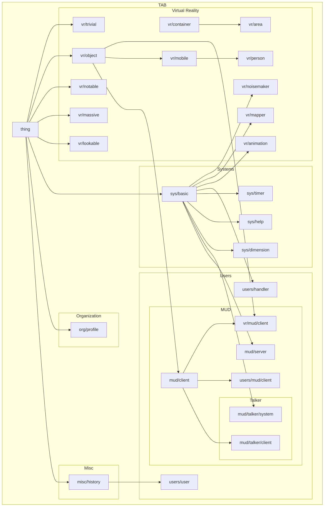

# TAB
*Things with Attributes and Behaviors*

> ***TAB*** is a system for structuring information to allow for computed analysis & manipulation.

TAB uses the Fennel programming language to establish a set of constructs to provide a framework for operations: A *thing* is *made* from a *model* defining the thing's *attributes* and *behaviors*.

***Note:*** TAB is currently in the earliest stages of development, and is created as a hobby-project. Code is incomplete, buggy, likely to change, and unlikely to ever be suitable for use by others.

## Getting Started

To use TAB, you'll need Lua & Git installed on your system.

	$ make tab-bin
	
Once that's done, you can start the Fennel REPL with the `fennel` command, and from there you can load in TAB and start making things:

```
>> (local tab (require :tab))
nil
>> (local apple (tab.make-thing :vr/object {:name :apple}))
nil
>> (local backpack (tab.make-thing :vr/container {:name :backpack}))
nil
>> backpack.contents
[]
>> (apple:move backpack)
nil
>> (tab.list-values backpack.contents :name)
["apple"]
```

## Map of Models


