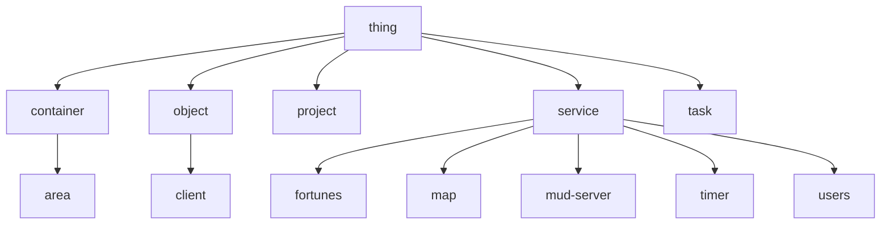

# MarMUD
*in midst of a million nightmares, a hold on one dream*

***MarMUD*** is the working name of the MUD engine being built by and for the GAZ.

## Use

### Client

#### Understanding the system

MarMUD is a Multi-User Dimension:

- Multi-User means that more than one person can use it at a time: rather than running on your own computer, it runs on a server on the Internet.
- Dimension means rather than serve up documents like a Web server, it maintains a virtualized environment that you interface with.

Within the dimension, you yourself are a virtual object - a person, capable of looking around virtual areas, moving between them, and interacting in various ways.

    > look
	You look around.
	561 Garden, entrance
	  Mulch paths lead south to the rock
	garden and west to where fig trees grow surrounded by perennial herbs.
	What: irises, Virginia spiderwort, sedum
	Who: emsenn and Iris
	Exits: south and west

#### Connecting

	$ telnet localhost 4242

### Admin

#### Running the System

    $ make lsr

#### Building the System

    $ make gos-bin

#### Understanding the System

There's a central engine, that makes "things", which are based on models that specify one or more sets of behavior. Models basically set up the schema for a given type of information, and behaviors determine how that info, when vitualized as a thing, can act.

These models and behaviors knit together in a way that forms the MUD.

##### Basic Things

The following few sections describe some of the foundational models and their behaviors; these form the foundation that most other models are based on.

The most-foundational thing is, well, the Thing. It has a `name`, a `description`, and a list of `behaviors`. (A basic thing doesn't have any behaviors, its just convenient to set up the list right away.)

It's important to note that a Thing doesn't necessarily have to represent a physical thing: abstract concepts like a Plan are also Things.

###### Objects, Containers, and Areas

That said, a lot of Things are Objects, which basically means they're treated like real physical, well, objects - at least, "real" within the scope of the virtual reality we're making out of Things. In order to be "real" in that way, an Object needs to have a `location`, which is some other Thing that is a Container (e.g. can contain objects).

There's a variation of Container, an Area, that has another attribute, beside `contents`: `exits`, which is a table of other Areas an Object can `move` to.
###### Mapper, Timer, and Server Services

How does the engine find one area from another? By using another type of Thing, a Service, specifically the Mapper service, with behaviors for looking up areas based on ID and other such things.

There's a couple other services that are really important:

There's a Timer. Where Mapper helps simulate spatial dimensions, the Timer helps simulate temporality, by letting "events" get scheduled some number of "ticks" in the future. (A tick is 1/5th a second, give or take.)

And there's a Server, that lets folk connect via TELNET and associates them with a Client thing, which is notable for being able to be controlled by the connected person, not just the engine. (I mean, their control goes through the engine, but.)

##### Funkier Models

###### User Accountant

The User Accountant handles keeping different users of the MUD separate from each other and helps protect privileged access. User is a kind a Thing that's merged with a Client once that Client logs in.

###### Project Management, Beliefs to Tasks

Beliefs are a very abstract thing; they're a description of a thing that could be true.

Goals are a description of something that is desired. Most Goals are associated with one or more Beliefs that describe *why* they are wanted.

Projects are how Goals are realized. They contain a list of Tasks.

Tasks are descriptions of actions that can be taken, sometimes with additional information like the tools required, the time the task takes, etc.

###### Libraries and Entries

Libraries are collections of (library) Entries, which are either references to external documents like PDFs or images, or just, text stored inside the entry itself.

## Model Map

## Plans
### Soon
- [ ] Add a talker (chat channels)
- [ ] Add a reference library
- [ ] Add user profiles
  - [ ] Add `finger` command (lol, but its tradish)
### Later
- [ ] Add colours to the MUD output
### Someday
- [ ] Add MXP, MSSP, etc., support
